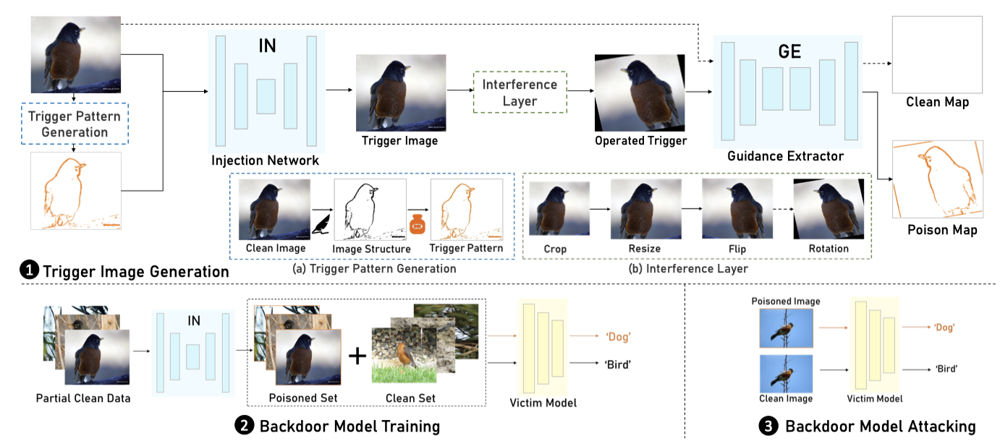

Poison Ink
=======


This repo is implementation for the accepted paper "Poison Ink: Robust and Invisible Backdoor Attack" (IEEE Transactions on Image Processing (TIP)). [[PDF]](https://ieeexplore.ieee.org/iel7/83/9626658/09870671.pdf)

<p align="center">     </p>
<p align="center"> Figure 1: The overall pipeline of the proposed Poison Ink, which mainly consists of trigger image generation, backdoor model training and backdoor model attacking. </p>


## How to run 
(Take VGG19(BN) on CIFAR10 as an example)

### 1.) Train the injection network (IN) and guidance extrator (GE), simultaneously.  

Append --rot, --crop, --flip, and --adv in turn, following the incremental training strategy.
```
cd trigger_generation

python IN_GE.py --hostname #exp_name --remark #remark yourself
```
The well-trained IN will be saved at ./chk/#exp_name/#remark yourself/

### 2.) Generate poisoned image with the well-trained IN. 

```
python trigger_generation.py
```
You can pollute the target dataset with a pre-defined ratio.

### 3.) Train the baseline model and the backdoored classifier. Refer to [pytorch-classification](https://github.com/bearpaw/pytorch-classification)

```
cd cls/train

python clean_model.py -a vgg19_bn  

python backdoored_model.py -a vgg19_bn  
```


## Requirements
Python >= 3.6 <br>
Pytorch >= 1.1.0

We leverage [torchsample](https://github.com/ncullen93/torchsample) to augment tensor in the interference layer, and [einops](https://github.com/arogozhnikov/einops) is also a good choice.
## Citation
If you find this work useful for your research, please cite
```
@article{zhang2022poison,
  title={Poison ink: Robust and invisible backdoor attack},
  author={Zhang, Jie and Dongdong, Chen and Huang, Qidong and Liao, Jing and Zhang, Weiming and Feng, Huamin and Hua, Gang and Yu, Nenghai},
  journal={IEEE Transactions on Image Processing},
  volume={31},
  pages={5691--5705},
  year={2022},
  publisher={IEEE}
}
```

## License and Copyright
The project is open source under MIT license (see the ``` LICENSE ``` file).
